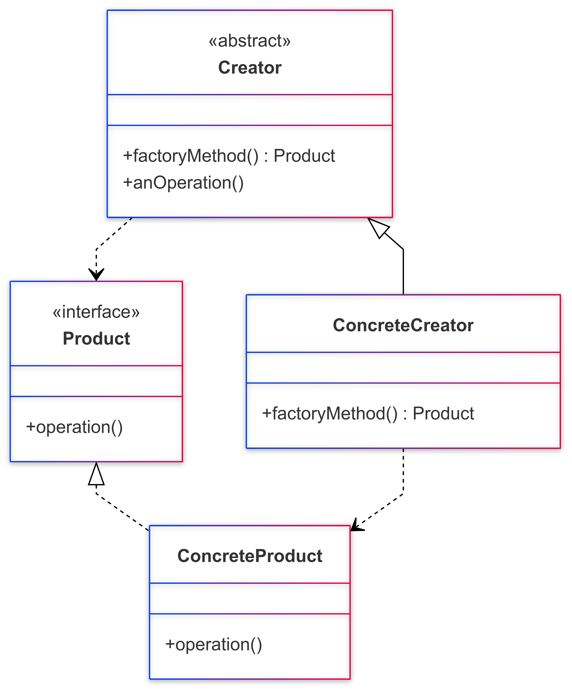

# Factory Method Pattern
## 의도
구체적으로 어떤 인스턴스를 만들지는 서브 클래스가 정한다. 
객체를 생성하기 위해 인터페이스를 정의하지만, 어떤 클래스의 인스턴스를 생성할지에 대한 결정은 서브클래스가 내리도록 한다.

## 동기
프레임워크는 클래스를 인스턴스로 만들어야 하지만, 추상 클래스 밖에 모르는 프레임워크는 클래스의 인스턴스화 작업을 수행할 수 없습니다. 왜냐하면 추상 클래스는 인스턴스를 가질 수 없기 때문입니다.

## 활용성
1. 어떤 클래스가 자신이 생성해야 하는 개체의 클래스를 예측할 수 없을 때
2. 생성할 객체를 기술하는 책임을 자신의 서브클래스가 지정했으면 할 때
3. 객체 생성의 책임을 몇 개의 보조 서브클래스 가운데 하나에게 위임하고, 어떤 서브클래스가 위임자인지에 대한 정보를 국소화시키고 싶을 때

## 참여자

- Product : 팩토리 메서드가 생성하는 객체의 인터페이스를 정의.
- ConcreteProduct : Product 클래스에 정의된 인터페이스를 실제로 구현.
- Creator : Product 타입의 객체를 반환하는 팩토리 메서드를 선언.
- ConcreteCreator : 팩토리 메서드를 재정의하여 ConcreteProduct의 인스턴스를 반환

## 장점
OCP 원칙에 맞게 확장성 있는 코드를 설계할 수 있다. (기존 로직을 수정하지 않고, 그와 같은 류의 새로운 인스턴스에 대해 확장이 가능) 
Creator 와 Product 간에 결합도를 느슨하게 가져갔기 때문

## 단점
각자의 역할을 나누기 때문에 클래스의 개수가 많아질 수 있다.

## 실무에서 어떻게 쓰이나?
Calendar 클래스, NumberFormat  
Spring - BeanFactory

## 모르는 단어 정리

## 알게된 점
인터페이스 안에서 private 메서드 (Private Method - Java 9부터) 생성할 수 있다.